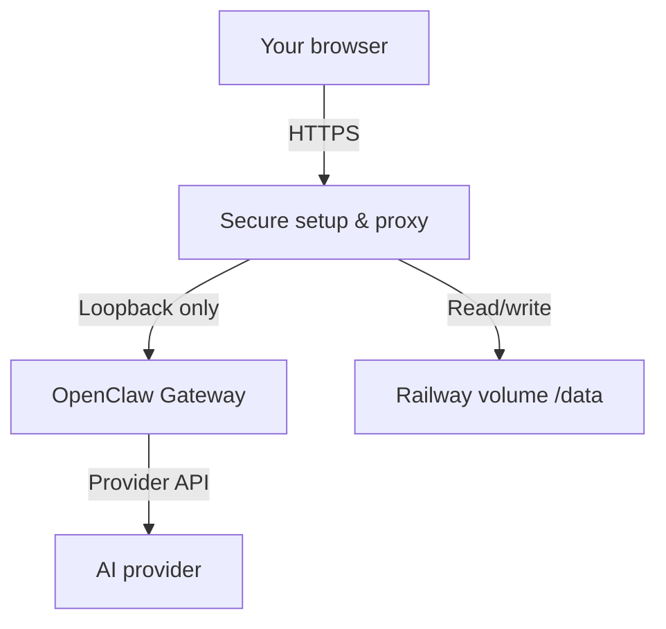

<div align="center">
  

  # OpenClaw on Railway

  **A secure, browser-guided way to run modern OpenClaw with durable storage on Railway.**

  [](https://github.com/Timboslice212/openclaw-railway-template/actions/workflows/ci.yml)
  [](https://github.com/openclaw/openclaw/releases/tag/v2026.9.2)
  [](package.json)
  [](LICENSE)

  <a href="https://railway.com/deploy/openclaw-secure-one-click-setup"></a>

  **[Deploy OpenClaw on Railway](https://railway.com/deploy/openclaw-secure-one-click-setup)**

  [Deployment guide](docs/DEPLOYMENT.md) · [Troubleshooting](docs/TROUBLESHOOTING.md) · [Security](SECURITY.md) · [Contributing](CONTRIBUTING.md)
</div>

---

## Why this template

This project packages the official, version-pinned [OpenClaw](https://github.com/openclaw/openclaw) image with a secure Railway control layer. Configure the AI provider from a protected browser wizard, launch the official dashboard, and keep configuration, credentials, and workspace files on a persistent `/data` volume.

- **Modern OpenClaw:** pinned to a reviewed upstream release instead of a moving `latest` tag.
- **Browser-only setup:** configure a provider, model, channel, and DM access without a terminal or Railway shell.
- **Persistent by design:** setup refuses to claim success unless the `/data` volume is mounted.
- **Secure handoff:** the Gateway stays on loopback and OpenClaw issues a short-lived browser bootstrap.
- **Operationally ready:** health checks, bounded commands, redaction, non-root runtime, CI, and recovery diagnostics.

## Architecture



The public service listens on Railway's `PORT`. It serves the protected setup interface and proxies `/openclaw/` to the private Gateway at `127.0.0.1:18789`. OpenClaw state and workspace data live under `/data`.

## One-click deployment

1. Open the [OpenClaw Railway template](https://railway.com/deploy/openclaw-secure-one-click-setup).
2. Railway asks for exactly one value: `SETUP_PASSWORD`.
3. Deploy the service, volume, variables, public domain, and `/healthz` check.
4. Open the generated domain and unlock the setup wizard.
5. Configure and validate OpenClaw, then launch its secure dashboard.

> [!IMPORTANT]
> `SETUP_PASSWORD` must be marked **Required** with an empty default in Railway Template Composer. `preserve()` in `.railway/railway.ts` preserves the value but does not create the required pre-deploy field by itself.

### Required variable

| Variable | Required | Default | Purpose |
| --- | :---: | --- | --- |
| `SETUP_PASSWORD` | Yes | Empty | Unlocks the secure setup dashboard. Must contain at least 12 characters; no username is required. |

Choose a unique password containing at least 12 characters. Do not reuse an AI-provider password or commit it to GitHub.

### Preconfigured variables

| Variable | Value |
| --- | --- |
| `OPENCLAW_STATE_DIR` | `/data/.openclaw` |
| `OPENCLAW_WORKSPACE_DIR` | `/data/workspace` |
| `OPENCLAW_INTERNAL_GATEWAY_HOST` | `127.0.0.1` |
| `OPENCLAW_INTERNAL_GATEWAY_PORT` | `18789` |
| `OPENCLAW_VOLUME_ROOT` | `/data` |
| `XDG_CONFIG_HOME` | `/data/.config` |
| `XDG_CACHE_HOME` | `/data/.cache` |

Read the complete [deployment guide](docs/DEPLOYMENT.md) before deploying the template.

## Setup Wizard

After Railway reports the deployment as healthy:

1. Open the Railway-generated HTTPS domain.
2. Enter the `SETUP_PASSWORD` chosen before deployment.
3. Select OpenAI, Anthropic, Google Gemini, OpenRouter, or xAI.
4. Enter the provider API key and optionally override the default model, or choose **Configure provider later in OpenClaw**.
5. Optionally connect Telegram or Discord.
6. Select **Configure & validate OpenClaw**. The wizard runs official onboarding, validates configuration, performs a provider probe, and waits for Gateway readiness. If provider setup was deferred, it starts the Gateway directly and leaves provider configuration to OpenClaw Settings.
7. Select **Open dashboard & complete pairing** to complete the browser handoff.

After first run, manage providers, agents, skills, and channels in the official OpenClaw dashboard. The setup page remains available for status and recovery diagnostics.

### Channel access and pairing

Telegram, Discord, and other channels can protect direct messages with OpenClaw's pairing policy. No terminal is required:

1. Open the OpenClaw dashboard from the completed setup page.
2. Send your bot a message to create an access request.
3. Go to **Settings → Channels → DM access requests**.
4. Review the sender and select **Approve**. You can optionally notify the requester.
5. Send the bot a new message after approval.

Pairing grants direct-message access; group permissions remain separate. If a request expires, message the bot again to create a new one.

## Features

- Protected first-run and recovery interface at `/setup`
- Official OpenClaw Control UI at `/openclaw/`
- Railway liveness at `/healthz` and Gateway readiness at `/readyz`
- Persistent state, workspace, configuration, and cache below `/data`
- Live provider validation before setup completes
- Optional Telegram and Discord credential probes
- Browser-only channel pairing guidance using OpenClaw's official DM access request screen
- Generated Gateway token with restrictive file permissions
- Native OpenClaw credential storage on the private persistent volume
- CSRF protection, login throttling, security headers, and redacted diagnostics
- Root used only to initialize a fresh volume; application processes run as UID/GID 1000
- Mock-based tests that do not contact an AI provider

## Persistence and backup

| Path | Contents |
| --- | --- |
| `/data/.openclaw` | OpenClaw configuration, managed credentials, and setup state |
| `/data/workspace` | Agent workspace and user files |
| `/data/.config` | Supporting application configuration |
| `/data/.cache` | Reusable runtime cache |

A volume survives normal redeployments, but it is **not an independent backup**. Export or snapshot `/data` before major upgrades. Protect every backup as an administrator secret because it can contain credentials and private workspace data.

## Security guidance

- Keep `SETUP_PASSWORD`, provider keys, channel tokens, and backups private.
- Use only the Railway-generated HTTPS domain for setup.
- Never expose port `18789`; the Gateway is intentionally loopback-only.
- Rotate any credential that appears in logs, screenshots, tickets, or commits.
- Review [SECURITY.md](SECURITY.md) before reporting a vulnerability.
- Do not publish a modified template until fresh deployment and existing-data upgrade tests pass.

## Updating OpenClaw

1. Review the target release and migration notes upstream.
2. Change `OPENCLAW_VERSION` in `Dockerfile`.
3. Update the version badge and [CHANGELOG.md](CHANGELOG.md).
4. Run `npm run verify`.
5. Test a fresh Railway deployment.
6. Back up `/data`, then test an upgrade with the existing volume.
7. Update the public Railway template only after both paths pass.

## Troubleshooting

Start with the setup-page diagnostics, then use the [troubleshooting guide](docs/TROUBLESHOOTING.md).

| Symptom | First check |
| --- | --- |
| Deployment never becomes healthy | Confirm Railway `PORT` and health path `/healthz`. |
| Wizard reports ephemeral storage | Confirm `openclaw-data` is mounted exactly at `/data`. |
| Login fails | Re-enter the exact `SETUP_PASSWORD`; do not add a username. |
| Provider validation fails | Verify the key, provider, model access, billing, and connectivity. |
| Dashboard is not ready | Check `/readyz`, then run Container status from `/setup`. |
| Data disappeared | Verify the same volume and all paths below `/data`. |

## FAQ

<details>
<summary><strong>Is this the official OpenClaw project?</strong></summary>

No. This is an independent Railway integration that runs the official OpenClaw container. OpenClaw retains its own license and trademarks.
</details>

<details>
<summary><strong>Why must the password be set before deployment?</strong></summary>

Collecting it in Railway avoids an unauthenticated first-visitor race on a public setup page.
</details>

<details>
<summary><strong>Can I use another provider or channel?</strong></summary>

The wizard supports five initial providers plus Telegram and Discord. Additional OpenClaw options can be configured after launch.
</details>

<details>
<summary><strong>Does redeploying erase my workspace?</strong></summary>

Not while the same `/data` volume remains attached. Deleting or replacing the volume can permanently remove its data.
</details>

<details>
<summary><strong>Do local tests call my AI provider?</strong></summary>

No. The suite uses a local mock Gateway and requires no provider credentials.
</details>

## Development

Requires Node.js 24 or newer:

```bash
npm run verify
```

This checks JavaScript syntax, documentation, local Markdown links, and the wrapper test suite.

## Credits and license

Built around the official [OpenClaw project](https://github.com/openclaw/openclaw). Thank you to its maintainers and contributors.

The Railway integration code and documentation are available under the [MIT License](LICENSE). OpenClaw is a separate upstream project and retains its own license and trademarks.
